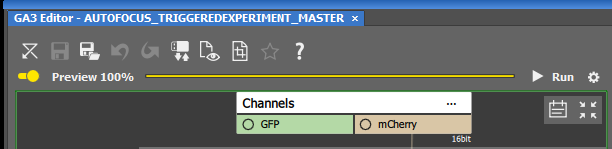
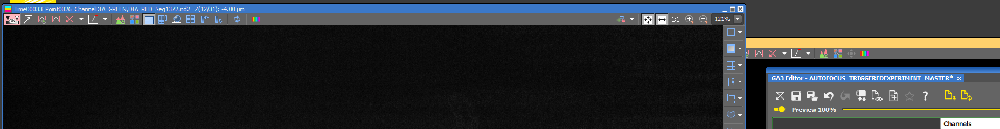
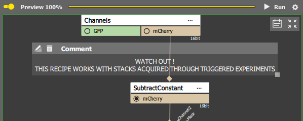
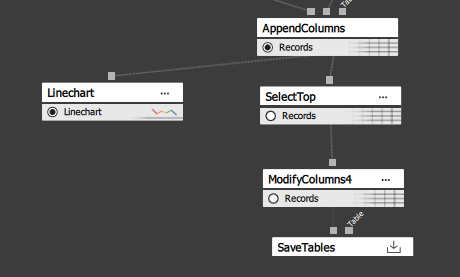
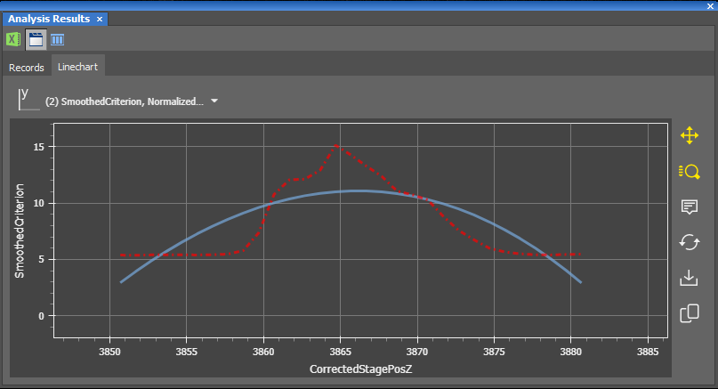
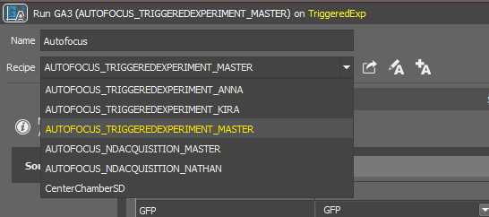
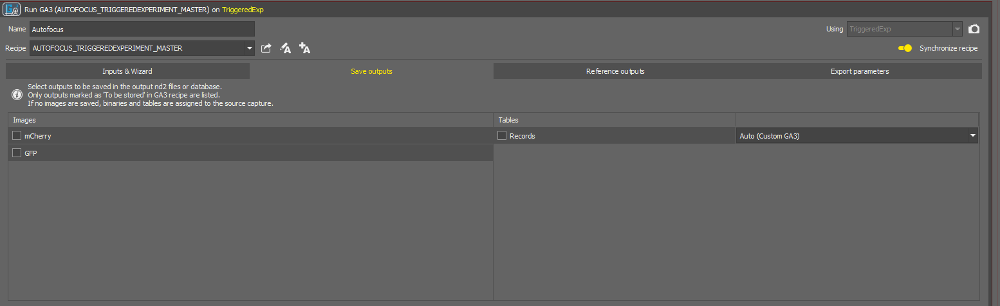
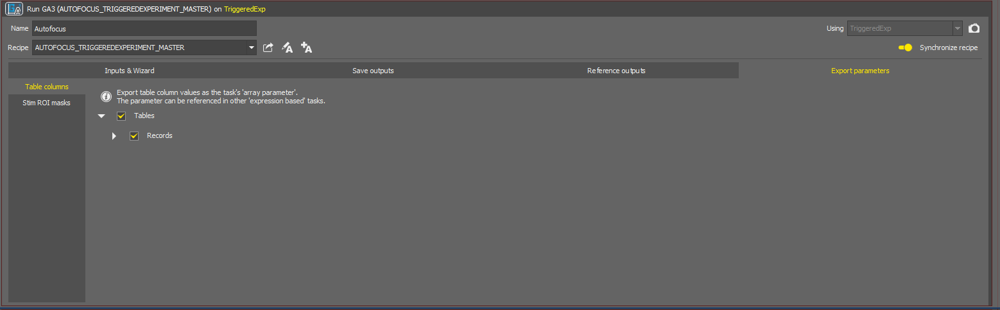

# Running a Z-stack microchamber experiment

This protocol describes the best way of running a Z-stack microchamber experiment. It uses GA3 to do autofocus and NIS Out Proc to automatically recenter each position using a CNN.

If it's your first time, install WSL and all the tools by following the instructions given here : https://github.com/spsalmon/NIS_out_proc_scripts

## 1. Creating the job

1. In the job explorer, open the VALIDATED_JOBS project and DUPLICATE one of the jobs there into your own project. You need to choose the job depending on what you need in your experiment. The main choice is between using Triggered Experiments or ND Acquisition. Triggered Experiment is less flexible but should be faster and more robust (?). ND Acquisition lets you do more things, like use triggered illumination, assymetric stacks, etc ...

2. Open the job and change the name and description to something that makes sense for your experiment.

3. Enter your positions. Please listen to the comments and do not modify things that should not be modified.

4. Modify / double check the OCs selected for the snapshots. 

5. Modify / double check the OCs selected for the Z-stacks.

## 2. Start the chamber alignment

1. If you're not using the alignment, disable the block in your job and continue to the next steps.
2. Start WSL by either by typing "wsl" in the windows search bar and clicking on the app, or by running "wsl" in a command prompt.
3. Go to the NIS_out_proc_scripts directory and then in the directory of the script (e.g. cd ~/NIS_out_proc_scripts/compute_chamber_offset)
4. Modify the config.yaml file, making sure that the channel you want to use, pixel size, etc ... are correct.
5. Activate the towbintools micromamba environment by running "micromamba activate towbintools"
6. Run the script by running "python compute_chamber_offset.py -c config.yaml"
7. Wait for the script to say "Ready", then continue. 

## 3. Verify the feedback microscopy part

1. Run the job until the first snapshot and Z-stack are acquired. Open them inside of NIS and check if they look good. 

### GA3 autofocus

1. Load the Z-stack you just acquired.

2. Open the GA3 explorer (Image / Analysis Explorer) and DUPLICATE the right master recipe depending on the type of experiment you are doing (triggered vs ND acquisition).

3. Open your copied recipe.

4. Turn Preview ON and link the Z-stack if it's not already.

5. Make sure the channels are correct and that the channel you want to use for autofocus is connected to the rest.

6. Verify that the autofocus is working correctly. Toggle the linechart

7. Look at the graph, if you see a clear peak, then it's working. If not, you might need to change the channel used or the recipe.

## 4. Last job verifications

1. Make sure you select the right GA3 recipe

2. In Save outputs, untick everything

3. In Export parameters, make sure Tables and Records are checked

4. You're now all set to run your job !